# ALRAJJ LEGACY Multi-Branch Enterprise ERP System

> **Comprehensive Project Memory, Architecture & Context Document**  
> **Last Updated**: September 11, 2026  
> **Repository**: `jasonvelasquez1410/laybare-payroll-system` (Branch: `main`)  
> **Primary Live Production URL**: [https://alrajj-legacy.vercel.app](https://alrajj-legacy.vercel.app)  
> **Client / Entity**: ALRAJJ LEGACY Fortified Business Corp.  
> **Client Lead**: Ms. Jehan Abedin, General Manager / Managing Director  
> **Authorized Branches**: Centrio Mall (Waxing Salon & Passion Nails), Limketkai Mall (Ketkai), SM Downtown Premier, and **Upcoming Iligan City Branch**  
> **Lead Developer & Presenter**: Jason Jeff D. Velasquez (Chief Technology Officer - CTO) & SETHCON Technologies Corp.  

---

## 📌 Table of Contents
1. [Executive System Architecture & Workflows](#1-executive-system-architecture--workflows)
2. [Active Core Modules & Capabilities](#2-active-core-modules--capabilities)
3. [Franchisee Operations: Lay Bare MyTime & PO Pipeline](#3-franchisee-operations-lay-bare-mytime--po-pipeline)
4. [Commercial Proposal, Costing & Contract Terms (₱150k Proposal / ₱120k Target)](#4-commercial-proposal-costing--contract-terms-150k-proposal--120k-target)
5. [Developer Payout & Milestone Allocation (50/50 Split)](#5-developer-payout--milestone-allocation-5050-split)
6. [Design Tokens & Brand Aesthetic](#6-design-tokens--brand-aesthetic)
7. [Key Files, Documents & Exported Deliverables](#7-key-files-documents--exported-deliverables)
8. [Quick Resume Guide After Laptop Restart](#8-quick-resume-guide-after-laptop-restart)

---

## 🏛️ 1. Executive System Architecture & Workflows

ALRAJJ LEGACY operates as a multi-branch Lay Bare & Passion Nails salon franchisee. The system replaces manual Google Sheets and fragmented software with a unified **Multi-Branch Enterprise ERP System**:

```mermaid
graph TD
    A[ALRAJJ LEGACY Enterprise ERP Core] --> B[Biometric HRMS & 5-Step Payroll]
    A --> C[Salon CRM & POS Ring-Up]
    A --> D[5-Step Purchase Order & MyTime Pipeline]
    A --> E[Philippine GAAP Accounting & BIR Tax Hub]

    B --> B1[NGTeco Raw Excel Ingestion .xls/.xlsx]
    B --> B2[Exception Resolution & Audit Log]
    B --> B3[Tardiness Counter & Auto DOLE NTE Letter]
    B --> B4[5-Stage BPI BizLink Electronic Batch Disbursement]
    B --> B5[Branded Printable Official Payslips]

    C --> C1[Live POS Service Ticket Ring-Up - Cash/GCash/Maya/Card]
    C --> C2[10% Specialist Commission Automation]
    C --> C3[VIP Client Retention, Skin Notes & Packages]
    C --> C4[Automated SMS Booking Confirmations]

    D --> D1[Store Requisitions - Centrio/Ketkai/SM/Iligan]
    D --> D2[Lay Bare Franchisor / MyTime Commissary Catalog]
    D --> D3[Management 1-Click Approval]
    D --> D4[Store Goods Receiving & Inspection DR]
    D --> D5[Automated 3-Way Match PO ↔ DR ↔ Invoice to AP]

    E --> E1[Executive Liquidity Cockpit - BPI ₱1.428M + Cash Floats]
    E --> E2[Multi-Branch P&L Statement with COGS]
    E --> E3[Consolidated Balance Sheet ₱4.121M Balanced]
    E --> E4[Accounts Payable Vouchers & 1-Click BPI Pay]
    E --> E5[Daily POS Cash Drawer Audits & Shift Reconciliation]
    E --> E6[General Ledger Double-Entry Journals]
    E --> E7[BIR Statutory Tax Hub - Form 1601-C / 2550Q / 0619-E]
```



---

## 💻 2. Active Core Modules & Capabilities

### Module 1: Biometric Attendance & HRMS (`activeTab === 'dashboard' | 'upload' | 'exceptions' | 'tardiness'`)
* **NGTeco Offline Ingestion**: Drag-and-drop parser for raw `.xls` / `.xlsx` attendance spreadsheets exported from offline biometric devices.
* **Auto Cross-Midnight & Split-Shift Pairing**: Pairs check-ins and check-outs automatically.
* **Exceptions & Overrides**: Resolves missing clock-outs with immutable supervisor audit logging.
* **Tardiness & Auto-NTE**: Frequency counter generates formal, DOLE-compliant Notice to Explain (NTE) letters in 1 click.

### Module 2: Biometric Payroll & 5-Step BPI BizLink Disbursement (`activeTab === 'payroll'`)
* **1-Click Computation**: Computes regular hours, overtime (1.25x), night diff (10%), and exact statutory deductions (SSS, PhilHealth, Pag-IBIG, BIR 1601-C Withholding Tax).
* **5-Stage Disbursement Lifecycle**:
  1. `HR Computed` (Math locked)
  2. `Forward to Accounting` (Audit review timestamped)
  3. `Generate BPI BizLink CSV` (Corporate bank batch file download)
  4. `MD Approval Sign-off` (Authorized by Ms. Jehan Abedin)
  5. `ATM Credited & Released` (Disbursed directly to staff BPI cards)
* **Official Printable Payslips**: Formatted with ALRAJJ LEGACY corporate logo and earnings/deductions breakdown.

### Module 3: Salon CRM & Live POS Ring-Up (`activeTab === 'crm'`)
* **Live Service Tickets**: Sub-tab for frontdesk staff to ring up completed salon services with presets (Brazilian Wax, Underarm, Gel Manicure, Spa Pedicure, Eyebrow Threading).
* **Payment Methods**: Cash, GCash QR, Maya QR, and POS Card Terminal.
* **Automated 10% Specialist Commission**: Calculates technician commission automatically and auto-syncs with daily cash drawer audits.
* **VIP Profiles & SMS**: Client skin notes, package balances, and SMS booking confirmations.

### Module 4: 5-Step Purchase Orders to Accounting (`activeTab === 'procurement'`)
* Replaces manual purchasing lists with a structured 5-step procurement workflow:
  * **Step 1: Store Requisition** (Branch submits supply request).
  * **Step 2: Vendor RFQ / MyTime Order Placement** (Pricing verification).
  * **Step 3: Management Approval** (Ms. Jehan / Kristene 1-click authorization).
  * **Step 4: Store Receiving & Inspection** (Branch lead checks package against Delivery Receipt).
  * **Step 5: 3-Way Matching & AP Push** (Auto-creates AP Voucher in Accounting and updates P&L COGS).

### Module 5: Enterprise Accounting & BIR Financial Management (`activeTab === 'accounting'`)
* **Lazy-Friendly Smart Health Bar**: 1-Click quick actions for non-accountant managers:
  * `1-Click Auto-Post Payroll` &rarr; Generates balanced General Ledger journal entry.
  * `1-Click BPI Quick Pay` &rarr; Disburses next pending supplier invoice.
  * `1-Click Auto-Audit All POS` &rarr; Balances all 4 branch shift cash drawers.
  * `Export Google Sheets CSV` &rarr; Downloads full P&L.
* **Multi-Branch P&L**: Filterable by `Consolidated`, `Centrio Waxing`, `Passion Nails`, `Limketkai`, and `SM Downtown`.
* **Balance Sheet**: Assets (`₱4,121,700.00`) = Liabilities (`₱562,500.00`) + Equity (`₱3,559,200.00`).
* **Daily POS Cash Drawer Audits**: `Opening Float + Cash Sales - Petty Expenses = Expected Count` with anti-theft variance detection.
* **BIR Statutory Tax Hub**: Automated computations for BIR Form 1601-C (Withholding), BIR 2550Q (VAT), BIR 0619-E (Expanded Withholding on Mall Leases), and SSS/PhilHealth/HDMF schedules.

---

## 📦 3. Franchisee Operations: Lay Bare MyTime & PO Pipeline

As an official Lay Bare franchisee, ALRAJJ LEGACY coordinates supply requisitions across 4 approved supplier categories:

1. **`Lay Bare Franchisor (MyTime Commissary)`** *(Default)*:
   * Cold/Hot Sugar Wax Pellets & Pots, Soothing Aloe Balms, Waxing Strips, Wooden Spatulas, Threading Cotton Spools, Lay Bare retail packs, Therapist uniforms.
   * *Workflow*: Staff create the requisition in the ALRAJJ system and submit the identical order items into the **MyTime Franchisor Portal**.
2. **`Glamour Pro Nails (Passion Nails Supplier)`**:
   * Gel polishes, UV/LED curing lamps, pure acetone, spa scrubs for Passion Nails Centrio.
3. **`CleanCare Solutions (Clinic Sanitation & PPE)`**:
   * Hospital-grade disinfectants, disposable couch rolls, nitrile gloves, 70% alcohol.
4. **`General Approved Local Vendor`**:
   * Mall maintenance supplies and miscellaneous store items.

---

## 💰 4. Commercial Proposal, Costing & Contract Terms (₱120k)

### Pricing Structure:
* **Base Scope (Previously ₱85k)**: Biometric HRMS, Payroll, CRM & Commissions, 5-Step PO Pipeline.
* **Accounting Add-on**: Multi-Branch P&L, Balance Sheet, Daily POS Cash Audits, Accounts Payable, General Ledger, BIR Tax Hub.
* **Official Proposal List Price**: **₱150,000.00 PHP**
* **Confidential Executive Closing Target**: **₱120,000.00 PHP** (If client requests a courtesy partner discount)
* **Upcoming Iligan City Branch**: Pre-configured for **zero additional core software licensing fee**.

### Maintenance & Retainer Plan:
* **Year 1 (Months 1–12)**: **100% FREE (₱0.00 / month)** — Includes cloud hosting, automated database backups, tax formula updates, and priority technical support.
* **Year 2 Onwards**: **₱12,000.00 / Year** (~₱1,000/month combined for all branches, or ~₱200/branch/month).

### Milestone Payment Schedule (Official ₱150k Proposal):
| Milestone | Scope / Deliverable | % | Amount |
| :--- | :--- | :---: | :---: |
| **Milestone 1: Mobilization** | Contract signing, database provisioning, biometric architecture setup | **40%** | **₱60,000.00** |
| **Milestone 2: Deployment & UAT** | HRMS, Biometric Ingestion, POS CRM, PO Pipeline deployed for testing | **35%** | **₱52,500.00** |
| **Milestone 3: Final Go-Live** | Accounting module sync, BPI BizLink sign-off, staff training, live launch | **25%** | **₱37,500.00** |
| **TOTAL** | | **100%** | **₱150,000.00** |

*(If closed at ₱120k: ₱48,000 / ₱42,000 / ₱30,000)*

### Lock-In & Exit Terms:
1. **12-Month Initial Service Term**: Guarantees system stability and complete annual tax/financial cycles.
2. **100% Client Data Ownership**: ALRAJJ LEGACY retains full ownership of all data.
3. **Zero Data Hostage Guarantee**: Complete unencrypted raw data (`.xlsx`, `.csv`, `.sql`) exported within 15 business days at zero charge upon non-renewal.
4. **Termination for Cause**: Client may terminate without penalty if system uptime is <99.5% or calculation errors are unresolved within 72 hours.
5. **60-Day Written Notice**: For annual renewal opt-out.

---

## 🤝 5. Developer Payout & Milestone Allocation (50/50 Split)

As Chief Technology Officer (CTO) & Lead Developer who architected, coded, and deployed the full system:

```
┌─────────────────────────────────────────────────────────────────────────────┐
│                      PROJECT PAYOUT BREAKDOWN (50/50 SPLIT)                 │
├──────────────────────────┬───────────────────────┬──────────────────────────┤
│ Proposal Scenario        │ Official ₱150k Price  │ Discounted ₱120k Target  │
├──────────────────────────┼───────────────────────┼──────────────────────────┤
│ Total Contract Value     │ ₱150,000.00           │ ₱120,000.00              │
├──────────────────────────┼───────────────────────┼──────────────────────────┤
│ CTO Developer Share (50%)│ ₱75,000.00            │ ₱60,000.00               │
│ (Jason Jeff D. Velasquez)│ • M1 (40%): ₱30,000   │ • M1 (40%): ₱24,000      │
│                          │ • M2 (35%): ₱26,250   │ • M2 (35%): ₱21,000      │
│                          │ • M3 (25%): ₱18,750   │ • M3 (25%): ₱15,000      │
├──────────────────────────┼───────────────────────┼──────────────────────────┤
│ SETHCON Share (50%)      │ ₱75,000.00            │ ₱60,000.00               │
│ (Operations & Sales)     │ • Corporate overhead  │ • Corporate overhead     │
└──────────────────────────┴───────────────────────┴──────────────────────────┘
```

---

## 🎨 6. Design Tokens & Brand Aesthetic

| Token / Role | Hex Code | Purpose / Usage |
| :--- | :--- | :--- |
| **Deep Corporate Navy** | `#031134` / `#082260` | Navigation active states, enterprise badges, BPI BizLink styling |
| **Gold / Prestige Accent** | `#D4AF37` / `#B48A10` | Financial badges, tax forms, VIP tiers |
| **Lay Bare Green** | `#77BC2E` / `#6DB027` | Primary action buttons, positive margins, balanced equation badges |
| **Warm Chocolate** | `#4A2E1B` | Section titles, employee avatars, primary typography |
| **Soft Floral Pink** | `#E89BB9` / `#D47098` | Disciplinary flags, exceptions, deduction figures, CRM accents |
| **Soft Lilac** | `#B58EBE` | Rest days, secondary branch indicators |
| **Canvas Background** | `#F7F8FA` / `#FAF9F5` | Modern Behance HRMS light background |

---

### Module 6: PWA Offline Resilience & Google Workspace Custom Domain
* **Offline PWA Architecture**: Progressive Web App with Service Worker (`sw.js`) and Web Manifest (`manifest.json`). Enables instant offline loading and desktop/iPad app installation.
* **Network Status Sensing**: Real-time `Online (Cloud Live Sync)` vs `Offline Mode (Local Storage Active)` status indicator in the top navbar.
* **Google Workspace Domain Linked**: Pre-configured for subdomain **`erp.alrajjlegacy-fortifiedbusinesscorp.com`** via Vercel CNAME `cname.vercel-dns.com`.
* **Non-Techie 1-2-3 Easy Guide**: Built-in 4-step quick walkthrough modal for store managers and supervisors.

---

## 📁 7. Key Files, Documents & Exported Deliverables

1. **Official PDF Proposal Contract**:
   * [`ALRAJJ_LEGACY_ERP_PROPOSAL_CONTRACT.pdf`](file:///c:/Users/USER/Documents/Programming%20Folder%20Rep/LAYBARE-payroll-system/ALRAJJ_LEGACY_ERP_PROPOSAL_CONTRACT.pdf) *(916 KB with SETHCON logo and ₱150k package pricing)*
   * [`ALRAJJ_LEGACY_ERP_PROPOSAL_CONTRACT_150K.pdf`](file:///c:/Users/USER/Documents/Programming%20Folder%20Rep/LAYBARE-payroll-system/ALRAJJ_LEGACY_ERP_PROPOSAL_CONTRACT_150K.pdf)
2. **Printable Executive HTML Contract**:
   * [`ALRAJJ_LEGACY_ERP_PROPOSAL_CONTRACT.html`](file:///c:/Users/USER/Documents/Programming%20Folder%20Rep/LAYBARE-payroll-system/ALRAJJ_LEGACY_ERP_PROPOSAL_CONTRACT.html) *(Open in browser and press `Ctrl + P` to print)*
3. **Markdown Contract Document**:
   * [`ALRAJJ_LEGACY_ERP_PROPOSAL_CONTRACT.md`](file:///c:/Users/USER/Documents/Programming%20Folder%20Rep/LAYBARE-payroll-system/ALRAJJ_LEGACY_ERP_PROPOSAL_CONTRACT.md)
4. **PowerPoint & Demo Presentations**:
   * [`ALRAJJ_LEGACY_Payroll_Demo_Presentation.pptx`](file:///c:/Users/USER/Documents/Programming%20Folder%20Rep/LAYBARE-payroll-system/ALRAJJ_LEGACY_Payroll_Demo_Presentation.pptx)
   * [`presentation_deck.html`](file:///c:/Users/USER/Documents/Programming%20Folder%20Rep/LAYBARE-payroll-system/presentation_deck.html)
   * [`PRESENTER_CHEAT_SHEET.html`](file:///c:/Users/USER/Documents/Programming%20Folder%20Rep/LAYBARE-payroll-system/PRESENTER_CHEAT_SHEET.html)
   * [`TUESDAY_DEMO_SCRIPT_AND_GUIDE.md`](file:///c:/Users/USER/Documents/Programming%20Folder%20Rep/LAYBARE-payroll-system/TUESDAY_DEMO_SCRIPT_AND_GUIDE.md)
5. **Core Application Source Code**:
   * Frontend App: [`frontend/src/App.jsx`](file:///c:/Users/USER/Documents/Programming%20Folder%20Rep/LAYBARE-payroll-system/frontend/src/App.jsx)
   * PWA Manifest & Service Worker: [`frontend/public/manifest.json`](file:///c:/Users/USER/Documents/Programming%20Folder%20Rep/LAYBARE-payroll-system/frontend/public/manifest.json) & [`frontend/public/sw.js`](file:///c:/Users/USER/Documents/Programming%20Folder%20Rep/LAYBARE-payroll-system/frontend/public/sw.js)
   * Backend Server: [`backend/server.js`](file:///c:/Users/USER/Documents/Programming%20Folder%20Rep/LAYBARE-payroll-system/backend/server.js)

---

## 🔄 8. Quick Resume Guide After Laptop Restart

When you turn on your laptop and resume working, follow these simple steps:

### Step 1: Open PowerShell / Terminal in Workspace Root
```powershell
cd "c:\Users\USER\Documents\Programming Folder Rep\LAYBARE-payroll-system"
```

### Step 2: Launch Frontend Development Server
```powershell
cd frontend
npm run dev
```
*App will be accessible at `http://localhost:5173`.*

### Step 3: Launch Backend Server (Optional for local API testing)
```powershell
cd "c:\Users\USER\Documents\Programming Folder Rep\LAYBARE-payroll-system\backend"
node server.js
```
*API will run at `http://localhost:5000`.*

### Step 4: Live Production URL
* The cloud production deployment is always live at: **[https://alrajj-legacy.vercel.app](https://alrajj-legacy.vercel.app)**
* Custom Google Workspace Subdomain: **`erp.alrajjlegacy-fortifiedbusinesscorp.com`**
