# ALRAJJ LEGACY Multi-Branch ERP Management System

> **Persistent Project Memory & Context Document**  
> **Last Updated**: September 8, 2026  
> **Repository**: `jasonvelasquez1410/laybare-payroll-system` (Branch: `main`)  
> **Primary Live Production URL**: [https://alrajj-legacy.vercel.app](https://alrajj-legacy.vercel.app)  
> **Client / Entity**: ALRAJJ LEGACY Fortified Business Corp.  
> **Target Branches**: Centrio Mall (Waxing Salon & Passion Nails), Limketkai Mall, SM Downtown Premier  
> **Client Lead**: Ms. Jehan Abedin, General Manager  
> **Presenter & Technology Partner**: Jason Velasquez & SETHCON Technologies Inc.  
> **Presentation Assets**: `ALRAJJ_LEGACY_Payroll_Demo_Presentation.pptx`, `presentation_deck.html`, `PRESENTER_CHEAT_SHEET.html`  
> **Demo Guide**: `TUESDAY_DEMO_SCRIPT_AND_GUIDE.md`  

---

## 🏢 1. Executive System Overview
Following the successful executive demonstration with Ms. Jehan Abedin, **ALRAJJ LEGACY** has evolved from an HRMS & timecard tracking tool into a unified **Multi-Branch Enterprise ERP Management Suite**.

```mermaid
graph TD
    A[ALRAJJ LEGACY Enterprise ERP Core] --> B[Executive & Financial Operations]
    A --> C[Biometric HRMS & 5-Stage Payroll]
    A --> D[Workforce & Exception Management]
    A --> E[SETHCON Enterprise Suite]
    
    B --> B1[Multi-Branch P&L - Philippine GAAP]
    B --> B2[Consolidated Balance Sheet]
    B --> B3[Accounts Payable - PO Linked]
    B --> B4[Daily POS Cash Audit & Reconciliation]
    B --> B5[General Ledger & Double-Entry Journal]
    B --> B6[BIR Tax Hub 1601-C / 2550Q / 0619-E]

    C --> C1[NGTeco Punch Ingestion]
    C --> C2[5-Step BPI BizLink Disbursement]
    C --> C3[Official Printable Payslips]

    D --> D1[Exceptions & Overrides]
    D --> D2[Tardiness & Auto DOLE NTE]
    D --> D3[Staff Directory]

    E --> E1[Salon CRM & VIP Loyalty]
    E --> E2[5-Step Purchase Order Pipeline]
    E --> E3[SETHCON Enterprise Profile]
```



---

## 🏛️ 2. Core ERP Modules & Capabilities

### Module 1: Enterprise Accounting & Financial Operations (`activeTab === 'accounting'`)
- **Executive Liquidity Cockpit**: Real-time monitoring of BPI BizLink Corporate Bank Account (`₱1,428,500.00`) and physical petty cash floats across Centrio Waxing (`₱25k`), Passion Nails (`₱20k`), Limketkai (`₱25k`), and SM Downtown (`₱20k`).
- **Multi-Branch Profit & Loss (P&L)**:
  - Branch filter: `Consolidated (All Branches)`, `Centrio Waxing`, `Passion Nails (Centrio)`, `Limketkai Mall`, and `SM Downtown Premier`.
  - Full GAAP structured breakdown: Operating Revenue (Waxing, Nails, Retail Products), Cost of Goods Sold (Wax Consumables, Gels, Sanitation, Packaging), Gross Margin (80.67% / ₱1.036M), Operating Expenses (Salaries, Store Rents, Utilities, Marketing, Maintenance, Depreciation), and EBITDA Net Income (₱453,950.00 / 35.33% Net Margin).
  - 1-click **Export to CSV** and **Printable Official Statement**.
- **Consolidated Balance Sheet**: Verified balanced equation: `Total Assets (₱4,121,700.00) = Total Liabilities (₱562,500.00) + Shareholder Equity (₱3,559,200.00)`.
- **Accounts Payable (PO Linked)**: Unpaid supplier bills with aging status and **1-Click "Pay via BPI BizLink"** (deducts bank balance and auto-posts double-entry General Ledger record).
- **Daily POS Cash Audit & Register Reconciliation**: Shift drawer balancing (`Opening Float + Cash Sales - Petty Out = Expected Count`) with anti-shrinkage variance detection (`₱0.00 Exact Match` vs `Over/Short` flags).
- **General Ledger & Double-Entry Journal**: Real-time Chart of Accounts with live search, audit source tagging (`[PAYROLL_RUN]`, `[PO_RECEIVING]`, `[AP_DISBURSEMENT]`, `[POS_REVENUE]`), and manual journal entry modal with real-time **Debit === Credit** validation rule.
- **Philippine BIR & Statutory Tax Compliance Hub**:
  - **BIR Form 1601-C** (Withholding on Compensation): Auto-computed from Biometric Payroll (`₱9,225.00` on `₱184.5k`).
  - **BIR Form 2550Q** (Quarterly VAT): Sourced from POS sales (`₱35,820.00` on `₱1.284M`).
  - **BIR Form 0619-E** (Expanded Withholding Tax on Mall Leases): 5% EWT on Ayala & SM lease dues (`₱14,750.00` on `₱295k`).
  - **SSS / PhilHealth / HDMF Monthly Contribution**: `₱24,200.00` scheduled via BPI BizLink.
- **Official Printable Financial Statements**: Executive letterhead modal with ALRAJJ LEGACY TIN `009-847-192-000` and signing blocks for Kristene (Accounting/HR Lead) and Ms. Jehan Abedin (Managing Director).

### Module 2: Biometric Payroll & 5-Step BPI BizLink Disbursement (`activeTab === 'payroll'`)
- Computes Gross-to-Net pay for salon staff across cutoffs (`2026-07-16 ~ 2026-07-31`).
- Basic Pay, Overtime (1.25x), Night Differential (10%), Late/Undertime Deductions, Statutory Deductions (SSS, PhilHealth, Pag-IBIG, Withholding Tax).
- **5-Stage Disbursement Lifecycle**:
  1. `HR Computed` (Calculations locked)
  2. `Forward to Accounting` (Audit review timestamped)
  3. `Generate BPI BizLink CSV` (Corporate bank batch file download)
  4. `MD Approval Sign-off` (Authorized by Ms. Jehan Abedin)
  5. `ATM Credited & Released` (Disbursed directly to BPI employee cards)
- **Official Printable Payslips**: Printable slip modal with ALRAJJ LEGACY corporate logo and complete earning/deduction breakdown.

### Module 3: Workforce Management & Compliance
- **Exceptions & Overrides (`exceptions`)**: Resolves unpaired clock-ins/outs and missing punches with an immutable audit log.
- **Tardiness & Notice to Explain (`tardiness`)**: Late frequency counter with built-in formal **DOLE-compliant Notice to Explain (NTE)** letter generator.
- **Biometric Ingestion (`upload`)**: Drag-and-drop parser for raw `.xls` / `.xlsx` files from **NGTeco** biometric time clocks.
- **Staff Directory (`employees`)**: Master employee list with BPI account numbers, daily rates, and statutory IDs.

### Module 4: SETHCON Enterprise Suite
- **Salon CRM & VIP Loyalty (`crm`)**: Client visit history, skin sensitivity notes, preferred specialists, package balances, and SMS booking alerts.
- **5-Step Purchase Order Pipeline (`procurement`)**: Store Requisition &rarr; Vendor RFQ &rarr; PO Approval &rarr; Goods Receiving & Inspection &rarr; **3-Way Matching & Direct Posting to Accounting AP**.

---

## 🎨 3. Design Tokens & Palette

| Token / Role | Hex Code | Purpose / Usage |
| :--- | :--- | :--- |
| **Deep Corporate Navy** | `#031134` / `#082260` | ERP headers, enterprise badges, primary branding, navigation active states |
| **Gold / Prestige Accent** | `#D4AF37` / `#B48A10` | Executive badges, financial statement accents, SETHCON Suite pills |
| **Lay Bare Green** | `#77BC2E` / `#6DB027` | Primary action buttons, positive margins, balanced equation badges, on-time tags |
| **Warm Chocolate** | `#4A2E1B` | Main typography, section titles, employee avatars |
| **Soft Floral Pink** | `#E89BB9` / `#D47098` | Disciplinary flags, exceptions, deduction figures, CRM accents |
| **Soft Lilac** | `#B58EBE` | Rest days, secondary branch indicators |
| **Canvas Background** | `#F7F8FA` / `#FAF9F5` | Modern Behance HRMS light background |
| **Card Surface** | `#FFFFFF` | Rounded cards (`rounded-3xl` / `rounded-2xl`) with `#EAE8E2` borders |

---

## 💻 4. Technology Stack & Deployment
- **Frontend**: React 19, Vite, Tailwind CSS v4, ECharts (`echarts-for-react`), Lucide React icons, Axios, Plus Jakarta Sans & Outfit fonts.
- **Backend**: Node.js / Express (`backend/server.js`), SQLite / Memory storage, XLSX parser (`xlsx`), CORS.
- **Production Hosting**: Vercel (`https://alrajj-legacy.vercel.app`).
- **Version Control**: GitHub `jasonvelasquez1410/laybare-payroll-system` (`main` branch).

---

## 🎬 5. Tuesday Live Demo Speaking Flow (Quick Reference)

1. **SETHCON Suite Profile (1 min)**: Click *Sethcon Suite* pill &rarr; highlight multi-branch retail software expertise and salon CRM.
2. **Executive Attendance Cockpit (1 min)**: Show top greeting (*"Welcome back, Kristene"*), 88% attendance donut chart, and live punch feed.
3. **Biometric Ingestion (1 min)**: Show NGTeco `.xls` upload portal & 1-click import.
4. **Exceptions & NTE (1.5 min)**: Resolve Cherimar's missing punch & show auto-drafted DOLE NTE letter.
5. **Biometric Payroll & BPI BizLink (1.5 min)**: Compute payroll & step through 5-stage BPI disbursement pipeline with printable payslips.
6. **Enterprise Accounting & Financials (2 min)**:
   - Walk through **Overview & Liquidity Cockpit** (`₱1.428M` BPI + branch floats).
   - Show **Profit & Loss (P&L)** with branch filter (*Centrio*, *Passion Nails*, *Ketkai*, *SM*, *Consolidated*) and 80.67% Gross Margin.
   - Show **Balance Sheet** (`₱4.121M` Assets = Liabilities + Equity).
   - Show **Accounts Payable** & click *"Pay BPI"* for instant General Ledger posting.
   - Show **Daily POS Cash Audit** & **BIR Tax Hub** (1601-C, 2550Q, 0619-E).

---

## 🔄 6. How to Resume After Laptop Restart

### Step 1: Open Terminal in Project Root
```bash
cd "c:\Users\USER\Documents\Programming Folder Rep\LAYBARE-payroll-system"
```

### Step 2: Start Frontend Development Server
```bash
cd frontend
npm run dev
```
*(Available locally at `http://localhost:5173`)*

### Step 3: Start Backend Server (Optional for local API testing)
```bash
cd "c:\Users\USER\Documents\Programming Folder Rep\LAYBARE-payroll-system\backend"
node server.js
```
*(Runs on `http://localhost:5000`)*


### Act 1: Executive Dashboard (1 Min)
- Show top header (*"Welcome back, Kristene"*), cutoff range (`2026-07-16 ~ 2026-07-31`).
- Show the 4 summary cards: Active Staff, Total Late Minutes, Avg Shift, and Missed Out Flags.
- Point out the **88% Attendance Donut Chart**.
- **Talking Point**: *"Ms. Jehan, leadership gets a live pulse of attendance across Centrio, Ketkai, and SM Downtown instantly without touching a spreadsheet."*

### Act 2: Biometric Ingestion (1 Min)
- Click **"Biometric Ingestion"** in the sidebar.
- Show the drag-and-drop zone accepting raw NGTeco `.xls` / `.xlsx` exports.
- **Talking Point**: *"No manual data entry. HR simply drops the raw machine export file here, and shift matching occurs automatically."*

### Act 3: Exceptions, Overrides & Automated NTE (1.5 Mins)
- Click **"Exceptions & Flags"** &rarr; click **"Resolve"** on a missing punch &rarr; enter `18:00` with audit notes &rarr; save.
- Click **"Tardiness & NTE"** &rarr; view late frequencies &rarr; click **"Generate Notice to Explain (NTE)"** to display the formal DOLE-compliant letter.
- **Talking Point**: *"Missing punches are adjusted in 5 seconds with an audit trail, and habitual tardiness triggers automated Notice to Explain letters with zero manual paperwork."*

### Act 4: 1-Click Payroll & Payslips (1.5 Mins)
- Click **"Accounting & Payroll"** &rarr; click green **"Compute Payroll"** &rarr; watch gross-to-net appear in 1 second.
- Click **"View Payslip"** to display the official printable payslip with the ALRAJJ LEGACY logo.
- **Talking Point**: *"What used to take 2 full days of manual math is now computed in 1 second—accurate, compliant, and ready to print."*

---

## 9. Presentation Files Inventory
- PowerPoint: `ALRAJJ_LEGACY_Payroll_Demo_Presentation.pptx`
- Web Slides: `presentation_deck.html`
- Full Speaking Script: `TUESDAY_DEMO_SCRIPT_AND_GUIDE.md`
- Persistent Agent Rules: `AGENTS.md`

